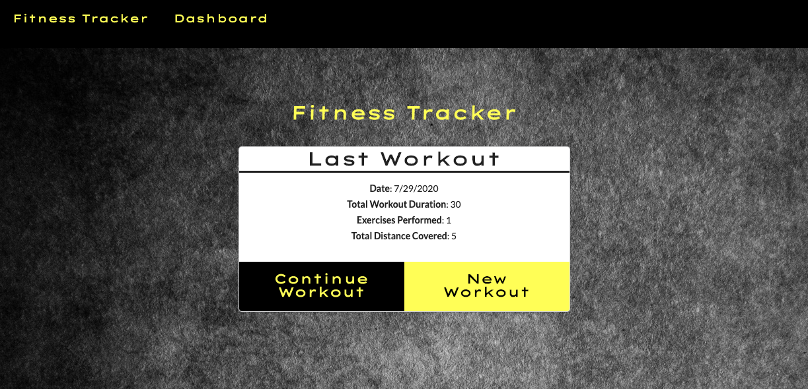
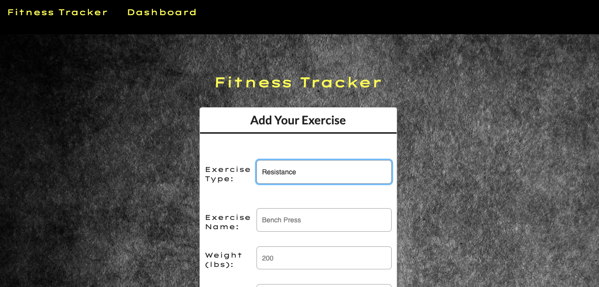
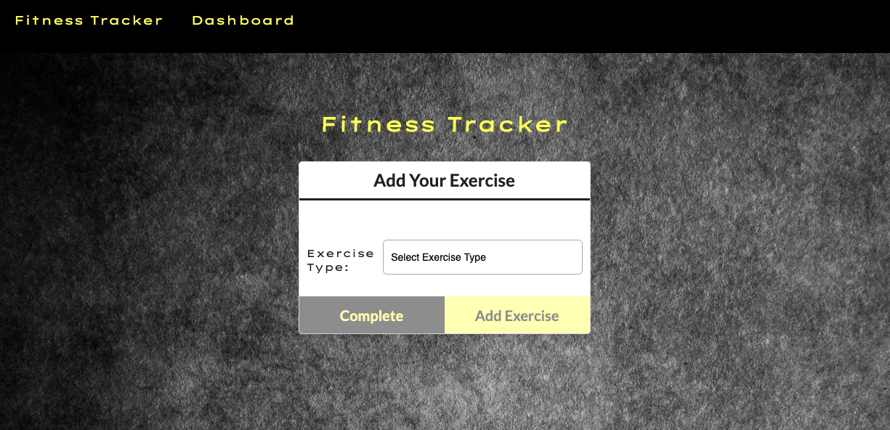
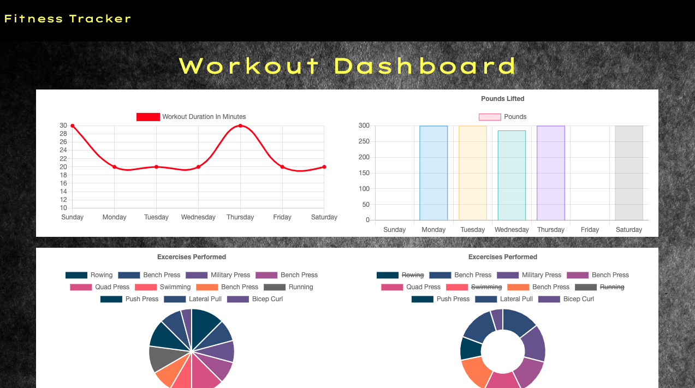

# Fitness Tracker

## About:
One of the most important traits a developer can have is adaptability. It is important to not become engrained with one method of operation, but instead stay open to new techniques and technologies. This is pertinent to not only languages, but technologies as well. 

The Fitness Tracker attests to the fact that multiple technologies can be used for the same purpose with equal efficiency. The Fitness Tracker utilizes MongoDB and Atlas to deploy an online databasing system that is not SQL based. The user can input workout routines and exercises, and use the dashboard to track their progress over time. Not only does the Fitness Tracker offer a practical way to approach working out, but it also offers a strong example in the diversity in databasing.

## Index
- [Fitness Tracker](#fitness-tracker)
  - [About:](#about)
  - [Index](#index)
  - [Installation:](#installation)
  - [Usage:](#usage)
  - [Contributors:](#contributors)
  - [GitHub Username:](#github-username)
  - [GitHub Repo:](#github-repo)
  - [GitHub Photo:](#github-photo)
  - [GitHub Email:](#github-email)
  - [Screenshots](#screenshots)
    - [Entering the Site](#entering-the-site)
    - [Creating an Exercise](#creating-an-exercise)
    - [Continuing Workout](#continuing-workout)
    - [Dashboard](#dashboard)

## Installation:
Enter NPM Install into your terminal while in the root folder.

## Usage:
Go to the deployed site at https://fitness-tracker-dashboard-app.herokuapp.com/

## Contributors:
Andrew Kleiner

## GitHub Username:
akleiner26

## GitHub Repo:
https://github.com/akleiner26

## GitHub Photo:
 

## GitHub Email:
AndrewJKleiner@gmail.com

## Screenshots

### Entering the Site

### Creating an Exercise

### Continuing Workout

### Dashboard

